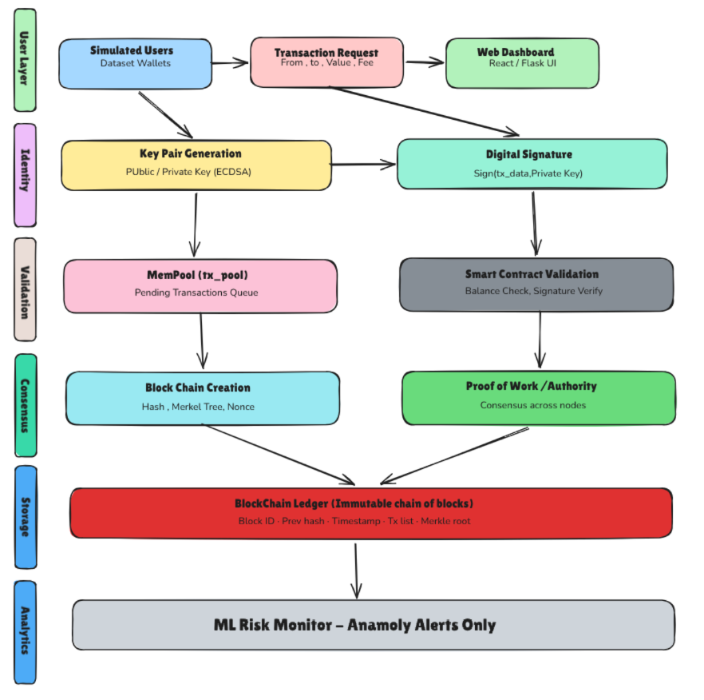

# Design and Implementation of a Secure Blockchain-Based Decentralized Financial Transaction System with Intelligent Risk Monitoring

---

## Project Description

This project focuses on the design and implementation of a secure decentralized financial transaction system using blockchain technology to ensure transparent, tamper-proof, and trustless transaction management. Transactions are validated through cryptographic mechanisms, smart contracts, and consensus protocols before being permanently recorded on a distributed ledger. The system eliminates reliance on centralized authorities while maintaining data integrity and security. An intelligent monitoring module is included as an additional layer to identify potentially risky transaction behavior without affecting the core blockchain operations.

---

## Architecture Diagram



---

## Tech Stack

| Component | Tool / Library | Purpose |
|---|---|---|
| Blockchain network | Ganache | Local Ethereum blockchain simulation |
| Smart contracts | Solidity + Truffle | Transaction validation, balance logic |
| Wallet / Identity | MetaMask / web3.py | Key pairs, digital signatures |
| Hashing | Python hashlib (SHA-256) | Block hash, transaction hash |
| Blockchain backend | Python / web3.py | Block creation, chain management |
| Dataset handling | Pandas | Load & feed Ethereum tx dataset |
| API layer | Flask | REST endpoints between UI and blockchain |
| Frontend dashboard | HTML/JS | View blocks, transactions, alerts |
| ML module (extra) | scikit-learn | Isolation Forest anomaly detection |
| Dataset | Ethereum tx dataset (Kaggle) | Simulated realistic tx workload |

---

## Course Outcome Mapping

- **CO1** — Understand the concepts of cryptocurrency, blockchain, and distributed ledger technologies
- **CO2** — Analyze the application and impact of blockchain technology in the financial industry
- **CO3** — Evaluate security issues relating to blockchain
- **CO4** — Design and analyse the impact of blockchain technology

---

## Execution Plan

---

### Phase 1 — Environment Setup
> Week 1 · Day 1–2 · Covers: CO1

- Install **Node.js** and **Ganache** — gives you a local Ethereum blockchain with 10 pre-funded test wallets
- Install **Truffle** framework — manages smart contract compilation, deployment, and testing
- Set up **Python environment** — install `web3.py`, `pandas`, `hashlib`, `Flask`, `scikit-learn` via pip
- Download the **Ethereum transaction dataset** from Kaggle
  - Columns used: `Record`, `TxHash`, `Block`, `Age`, `From`, `To`, `Value`, `TxFee`
- Verify setup — start Ganache, confirm wallets appear, run a simple `web3.py` connection test

---

### Phase 2 — Wallet Identity Module ✅
> Week 1 · Day 3 · Covers: CO1, CO3

**Status:** Complete · 55 tests passing · [SECURITY.md](SECURITY.md) for design decisions

#### Module Structure

```
wallet/
├── __init__.py          # Package exports
├── config.py            # Env-based configuration (no hardcoded secrets)
├── exceptions.py        # Custom exception hierarchy
├── address_loader.py    # CSV address extraction + Ethereum format validation
├── key_manager.py       # ECDSA key generation + encrypted persistence
└── signer.py            # Digital signature sign/verify with security protections
```

#### Features Implemented

| Feature | Implementation |
|---|---|
| Address loading | Extracts unique `From`/`To` addresses from CSV, filters non-hex labels |
| Address validation | Regex-based `0x` + 40 hex char check (EIP-55 compatible) |
| Key generation | ECDSA on secp256k1 (Ethereum-native curve) |
| Key encryption | AES-256-CBC via PBKDF2-HMAC (`BestAvailableEncryption`) |
| File permissions | Private keys written with `0o600` (owner-only) |
| Digital signatures | ECDSA-SHA256 with canonical JSON serialisation |
| Replay protection | UUID4 nonce embedded in signed message |
| Malleability protection | Low-S normalisation (BIP-62 / Ethereum convention) |

#### Usage

```python
from wallet.address_loader import load_addresses
from wallet.key_manager import generate_key_pair, save_keys
from wallet.signer import sign_transaction, verify_signature, create_nonce

# Load addresses from dataset
addresses = load_addresses()

# Generate and save keys for an address
private_key, public_key = generate_key_pair()
save_keys("0xabc...", private_key, public_key, passphrase="...")

# Sign a transaction
nonce = create_nonce()
signature = sign_transaction(tx_data, private_key, nonce)

# Verify the signature
is_valid = verify_signature(signature, public_key, tx_data, nonce)
```

#### Running Tests

```bash
# Full test suite with coverage
pytest tests/ -v --cov=wallet --cov-report=term-missing --cov-fail-under=80

# Lint check
ruff check wallet/ tests/

# Security scan
bandit -r wallet/ -ll
```

---

### Phase 3 — Smart Contracts ✅
> Week 1 · Day 4–5 · Covers: CO2, CO4

**Status:** Complete · Hardhat · Solidity 0.8.20 · Python web3.py interface

#### Contract Structure

```
contracts/
└── TransactionContract.sol   # Balance ledger + full tx lifecycle + events
scripts/
└── deploy.js                 # Hardhat deploy → writes deployment.json
blockchain/
├── __init__.py               # Package docstring
└── contract.py               # Python web3.py wrapper (ContractInterface)
tests/
└── test_contract.py          # Mocked unit tests (CI-safe, no live network)
hardhat.config.js             # Ganache (7545) + localhost (8545) networks
package.json                  # Hardhat + hardhat-ethers + ethers.js
```

#### Features Implemented

| Feature | Implementation |
|---|---|
| Balance ledger | `mapping(address => uint256) public balances` — internal wei ledger |
| Fund wallet | `fundWallet(address)` payable — sends ETH, credits ledger, emits `WalletFunded` |
| Submit transaction | `submitTransaction(receiver, value, fee)` — validates balance, reserves funds, returns `bytes32 txHash` |
| Balance validation | Reverts with `"insufficient balance"` if `value + fee > sender balance` |
| Approve transaction | Owner-only — credits receiver, emits `TransactionApproved` |
| Reject transaction | Owner-only — full refund (value + fee), stores reason on-chain, emits `TransactionRejected` |
| Events | `TransactionSubmitted`, `TransactionApproved`, `TransactionRejected`, `WalletFunded` |
| Python interface | `ContractInterface` — Pythonic wrapper with `from_deployment_file()` factory |

#### Usage

```bash
# 1 — Install Node dependencies (first time only)
npm install

# 2 — Start Ganache GUI or CLI on port 7545, then deploy:
npx hardhat run scripts/deploy.js --network ganache
# deployment.json written to project root

# 3 — OR use the built-in Hardhat node (port 8545):
npx hardhat node                                         # terminal 1
npx hardhat run scripts/deploy.js --network localhost    # terminal 2
```

```python
from web3 import Web3
from blockchain.contract import ContractInterface

w3 = Web3(Web3.HTTPProvider("http://127.0.0.1:7545"))
ci = ContractInterface.from_deployment_file(w3)       # reads deployment.json

# Fund sender ledger (1 ETH)
ci.fund_wallet("0xSENDER...", amount_ether=1.0, sender=w3.eth.accounts[0])

# Submit tx (0.5 ETH + 0.001 fee)
tx_hash = ci.submit_transaction(
    sender=w3.eth.accounts[1],
    receiver=w3.eth.accounts[2],
    value_ether=0.5,
    fee_ether=0.001,
)

# Approve or reject (owner = deployer)
ci.approve_transaction(tx_hash, owner=w3.eth.accounts[0])

# Query
record = ci.get_transaction(tx_hash)  # {"status": "Approved", "value_ether": 0.5, ...}
balance = ci.get_balance(w3.eth.accounts[2])
```

---

### Phase 4 — Block Creation and Chain Structure
> Week 2 · Day 1–2 · Covers: CO1, CO3, CO4

- Define the **Block data structure**
  ```
  block_id | previous_hash | timestamp | transactions[] | merkle_root | nonce | hash
  ```
- Build **SHA-256 hashing function**
  ```
  hash = SHA256(sender + receiver + value + timestamp + previous_block_hash)
  ```
  - Any change in value → hash changes → chain breaks (immutability proof)
- Build the **Merkle tree**
  - Hash each transaction → pair and hash again → single root hash remains
  - Allows single-transaction verification without loading the full block
- Build the **mempool (transaction pool)**
  - Validated transactions queue here
  - Miner collects batches of 5–10 transactions to form a block
- Build **chain linking logic**
  - Each block stores the previous block's hash
  - Tampering any block invalidates all blocks after it

---

### Phase 5 — Consensus Mechanism
> Week 2 · Day 3 · Covers: CO1, CO3, CO4

- Implement **Proof of Work (PoW)**
  - Miner tries different `nonce` values until `hash(block)` starts with `"000"`
  - Computationally hard to fake — this is the core mining demo
- Set **difficulty level** to 3 (three leading zeros)
  - Can increase difficulty to show impact on mining time
- Simulate **multiple nodes**
  - Create 2–3 Python node instances, each holding a full copy of the chain
  - When a block is mined, all nodes update
- Build **chain validation function**
  - `validate_chain()` walks every block and verifies hashes match
  - **Tamper demo** — modify a value in Block 2, re-validate, show chain breaks visually
  - *This is your strongest demo moment*

---

### Phase 6 — Flask API and Dashboard
> Week 2 · Day 4–5 · Covers: CO2, CO4

- Build **Flask REST API** with the following endpoints:
  - `POST /submit-transaction` — submit a new transaction
  - `GET /chain` — return the full blockchain
  - `GET /block/<id>` — return a specific block's details
  - `GET /validate` — run chain validation and return result
- Build **transaction feed UI**
  - Shows live transaction submissions, block mining status, chain growing in real time
- Build **block explorer view**
  - Displays each block: ID, hash, previous hash, timestamp, transaction list
  - *This is your main demo screen for viva*
- Add **tamper demonstration button**
  - Modify a transaction value in Block 2 → re-validate → chain breaks visually
  - Instantly shows immutability to evaluator

---

### Phase 7 — ML Risk Monitoring Module *(Extra Points)*
> Week 3 · Day 1 · Covers: CO2, CO3

- **Extract features** from transactions using `pandas`
  - Features: transaction value, gas fee, sender frequency, time between transactions
- Train **Isolation Forest** model from `scikit-learn`
  - Unsupervised — learns normal transaction patterns, flags anomalies automatically
  - No labelled data needed
- Integrate **risk alerts** into dashboard
  - Anomalous transactions show a warning flag
  - Blockchain still processes all transactions — ML is observer only
- Add **risk score badge** to block explorer
  - Each transaction displays: `Normal` or `Suspicious`
  - Demonstrates security awareness without affecting core blockchain logic

---

## Timeline Summary

| Week | Days | Phase | Status |
|---|---|---|---|
| Week 1 | Day 1–2 | Phase 1 — Environment setup | ✅ Complete |
| Week 1 | Day 3 | Phase 2 — Wallet identity module | ✅ Complete |
| Week 1 | Day 4–5 | Phase 3 — Smart contracts | ✅ Complete |
| Week 2 | Day 1–2 | Phase 4 — Block creation and chain | 🔲 Pending |
| Week 2 | Day 3 | Phase 5 — Consensus mechanism | 🔲 Pending |
| Week 2 | Day 4–5 | Phase 6 — Flask API and dashboard | 🔲 Pending |
| Week 3 | Day 1 | Phase 7 — ML risk module | 🔲 Pending |

---

## Key Demo Points for Viva

1. **Tamper a block value** → show chain validation breaking → proves immutability
2. **Show block structure** → block ID, previous hash, Merkle root → proves blockchain fundamentals
3. **Show mining in action** → nonce search, hash starting with "000" → proves Proof of Work
4. **Show signature verification** → valid vs invalid transaction → proves cryptographic identity
5. **Show risk alert** → anomalous transaction flagged → proves ML enhancement

---

*Blockchain is the core. ML is the enhancement.*
